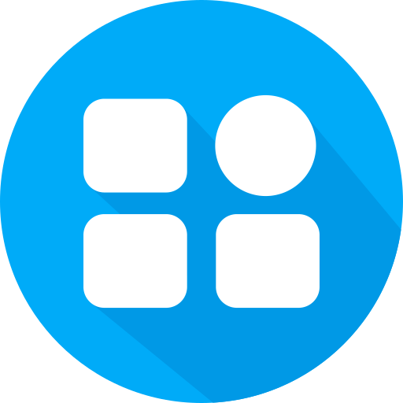
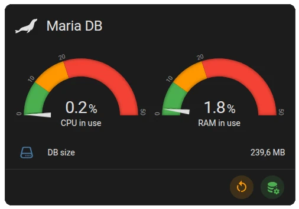
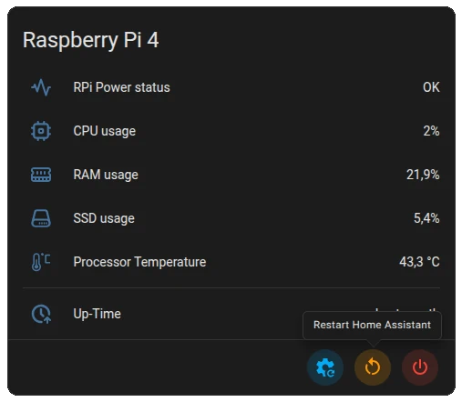
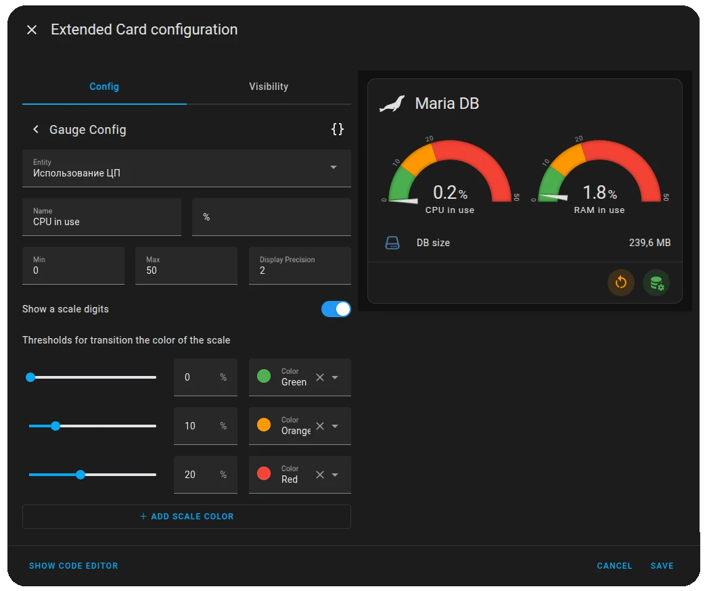

 
 Advanced UI Cards

If you mind the standard [**Lovelace**](https://github.com/home-assistant/frontend) theme is cute and don't want a new elements to mess this design, then this extension is for you. The extension complements the collection of interface maps, and makes it possible to combine several different objects in one map. And all settings are also available via the WEB interface. You no longer have to study the documentation every time you want to change something. Just activate the standard editing mode in the [**Home Assistant**](https://github.com/home-assistant), and change any map settings.

